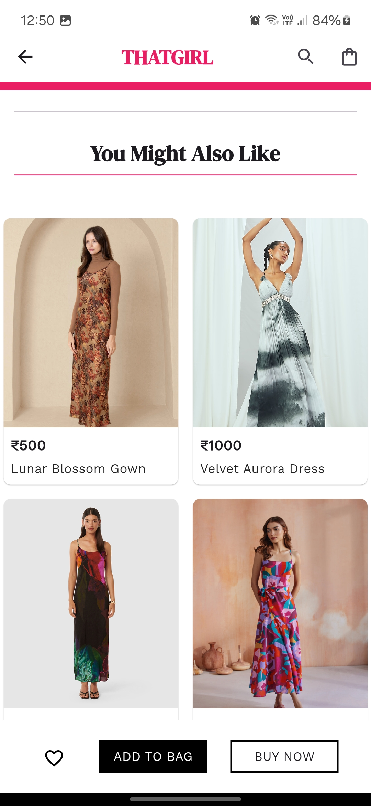
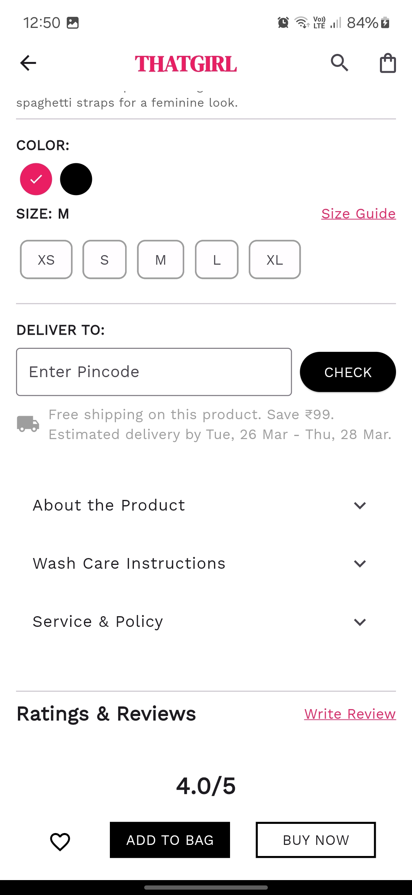

# Demo Task

Flutter app 

## App Screenshots

<p align="center">
  
  
  
  
</p>


## App Structure

The app follows the **MVVM (Model-View-ViewModel)** architecture for modularity and scalability.

```
lib/
│
├── repo/
│   ├── static_data.dart
│   └── utils/
│       ├── dimensions.dart
│       └── local_strings.dart
│
├── View/
│   └── widget/
│       ├── available_colors.dart
│       ├── carousel.dart
│       ├── customer_rating.dart
│       ├── info.dart
│       ├── size_choice.dart
│       └── product_page.dart
│
└── main.dart

```


### Prerequisites:
- Dart version: 3.5.4
- DevTools version: 2.37.3
- Flutter version: 3.24.5 (Stable)

---
Developed by Shubham choudhary
